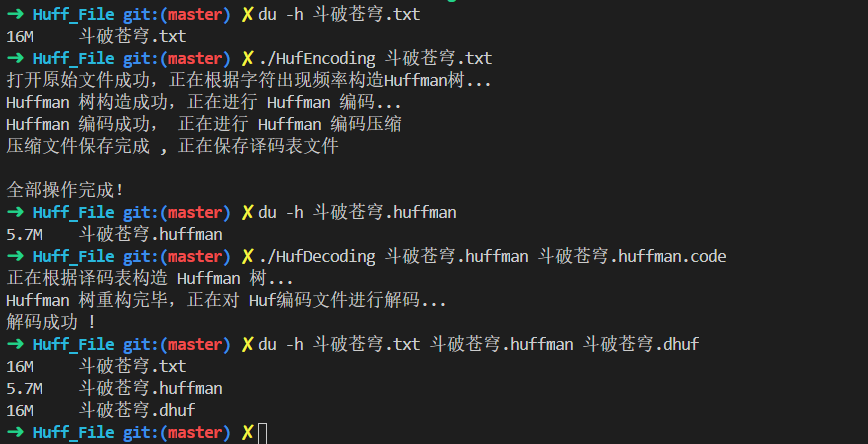
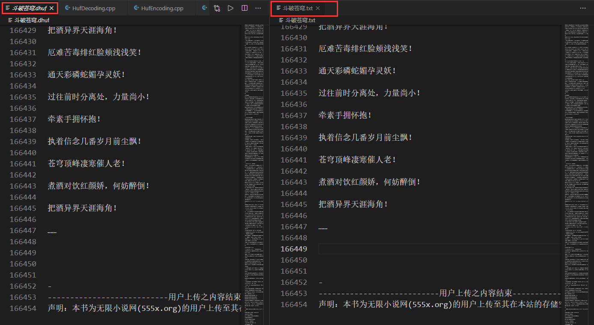

## 基于 Huffman 编码的文件压缩实现

哈夫曼二叉树是带权路径达到最小的二叉树，也叫最优二叉树；项目大概思路为：
1. 根据每个字符出现的频率作为权值构建哈夫曼二叉树； 
2. 按照左 ‘0’ 右 ‘1’ 遍历这颗二叉树就可以获取得到所有字符的编码了； 
3. 将对应的 “ 01 串”，按照位运算思想进行文件压缩；

### 项目效果图：

参考资料：[详细图解哈夫曼Huffman编码树](https://blog.csdn.net/FX677588/article/details/70767446#commentBox)